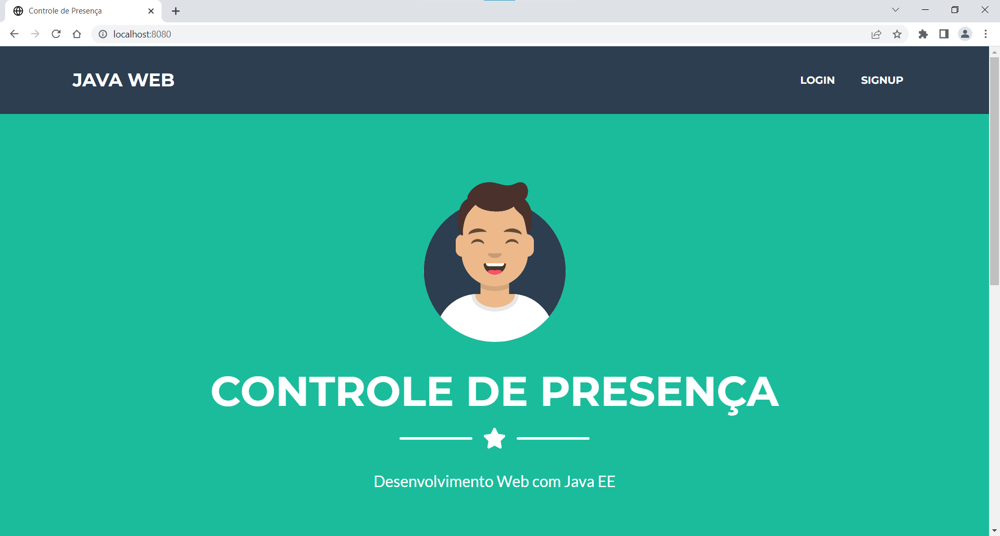

# Assessemt Fundamentos de Desenvolvimento JAVA

## Elvis Lopes

### Aplicação: Controle de presença:

* Classe Principal: Evento
* Classe Associação: Empresa
* Classe Mãe: Participante
* Classes Filhas: palestrante, organizador, ouvinte

Um EVENTO é feito por uma EMPRESA e possui vários PARTICIPANTES, tipo: diversos PALESTRANTES, alguns ORGANIZADORES e muitos OUVINTES.

Aplicação em execução: 

Home

login

dados cadastrados

participantes

